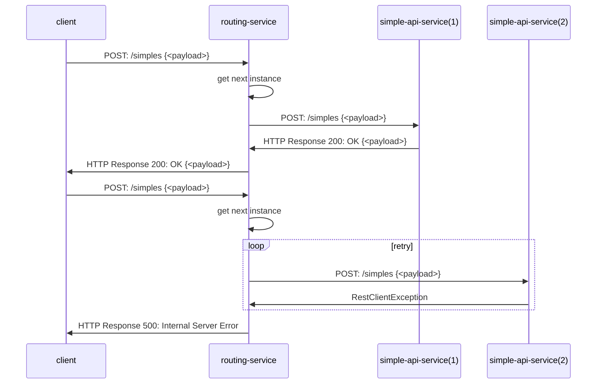
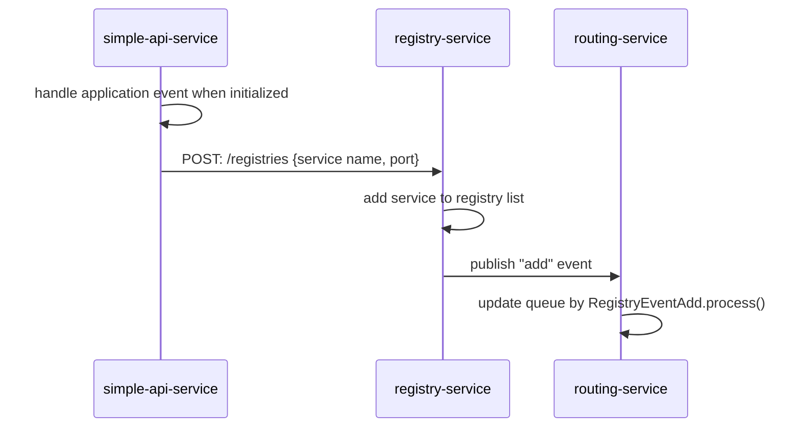
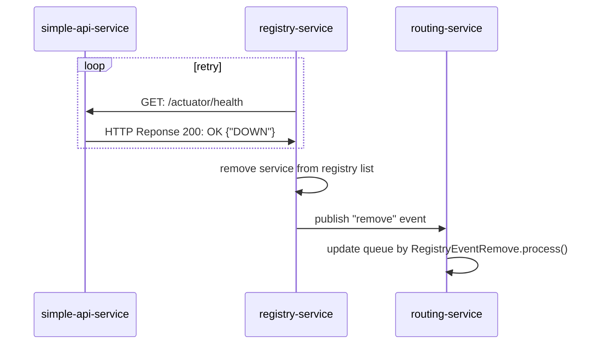

# routing-service
Routing Service as gateway and load balancer. Pass the HTTP Request to corresponsing service that registered with **registry-service** in a round-robin manner. Consisting of 2 modules: routing and registry.   

### Routing Module
Handle HTTP request for Routing API, passing the request to the corresponding service based on registry queue in round-robin manner

### Registry Module
Handle logic to process registry event subscribed from **registry-service**. Update the local registry queue to be in sync with the registry list in **registry-service**
 

## System Flow
### Routing the HTTP Request to simple-api-service

### Process registry event: Add Event

### Process registry event: Remove Event

For more information on other flows and services, see also [simple-api-service](https://github.com/punyisakra/simple-api-service) and [registry-service](https://github.com/punyisakra/registry-service)
